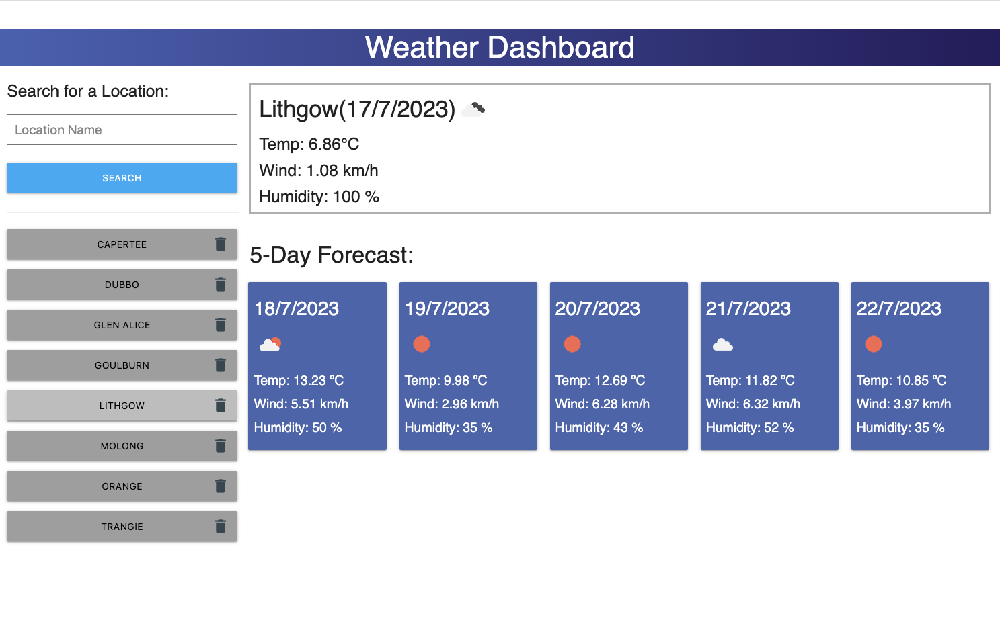

# Weather Dashboard

## Description

My Weather Dashboard is a useful Weather Forecasting tool that could help me plan a range of trips.

As a bushwalker the dashboard suits my trip planning requirement right now - day walks and multi-day trips in remote areas of the Australian bush.

As an astrophotographer, photographing the Milky Way, Deep Sky Objects and night timelapse sequences in a range of locations I can see the potential for extending the Weather Dashboard to get more detailed weather information I need to plan these trips. At the moment I have to use 3 or 4 different apps or websites to get the information required.

Data available through the OpenWeatherMap API will let me tailor my Weather Dashboard to provide the detailed information I need in one place. It's pretty exciting!

## Server-Side APIs: Weather Dashboard Link
Click the link to visit the deployed website: [Weather Dashboard][def1].

In my implementation:
1. JavaScript/jQuery is used to add/delete/modify elements as required to allow a dynamic interactive page
2. Locations are saved automatically to the Weather Collection
3. When the Dashboard loads it displays data for the 1st location in the collection (top button)
4. Locations can be deleted

## Data
1. Locations are automatically added to the Weather Collection in Local Storage
2. Each location's Name, Latitude and Longitude is stored in the collection
3. The Weather Colection is updated immediately if a Location is deleted

## Navigation
Navigation is very simple:
1: To add a Location
* Click in the Location Name field
* Enter the Name of a Location & click Search

   * For Australia - just enter the Location Name: ',AU' will be added to automatically
   * For other coutnries - enter the Location Name followed by a comma ',' and the 2 Character County Code (eg: Whitby, GB)

2: To view a Saved Location click on the button with the Location Name
3. To delete a saved location click on the Garbage Can icon at the right hand end of the button 

## Resources Used
1. Bootcamp Materials - Lesson Material from Weeks 1 - 8
2. Prior knowlege and experience
3. Group tutorial sessions
4. [jQuery ][def2] jQuery API Documentation
5. [Day.js][def3] Day.js Documentation
6. [Materialize][def4] Documentation
7. [Open Weather API][def5] Documentation
8. [MDM Web Docs][def6] Attribute Selectors
6. [MDM Web Docs][def7] Array.prototype.findindex()
7. [MDM Web Docs][def8] Array.prototype.includes()
8. [MDM Web Docs][def9] Array.prototype.splice()
9. [MDM Web Docs][def10] Arrow function expressions

[def1]: https://dingogap.github.io/Weather-Dashboard/
[def2]: https://jquery.com/
[def3]: https://day.js.org/en/
[def4]: https://materializecss.com/
[def5]: https://openweathermap.org/api
[def6]: https://developer.mozilla.org/en-US/docs/Web/CSS/Attribute_selectors
[def7]: https://developer.mozilla.org/en-US/docs/Web/JavaScript/Reference/Global_Objects/Array/findIndex
[def8]: https://developer.mozilla.org/en-US/docs/Web/JavaScript/Reference/Global_Objects/Array/includes
[def9]: https://developer.mozilla.org/en-US/docs/Web/JavaScript/Reference/Global_Objects/Array/splice
[def10]:https://developer.mozilla.org/en-US/docs/Web/JavaScript/Reference/Functions/Arrow_functions

